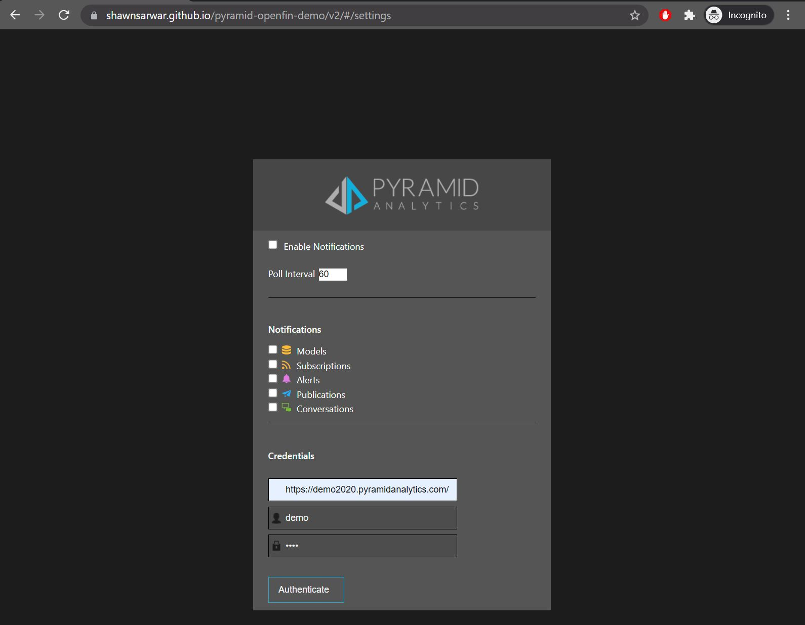
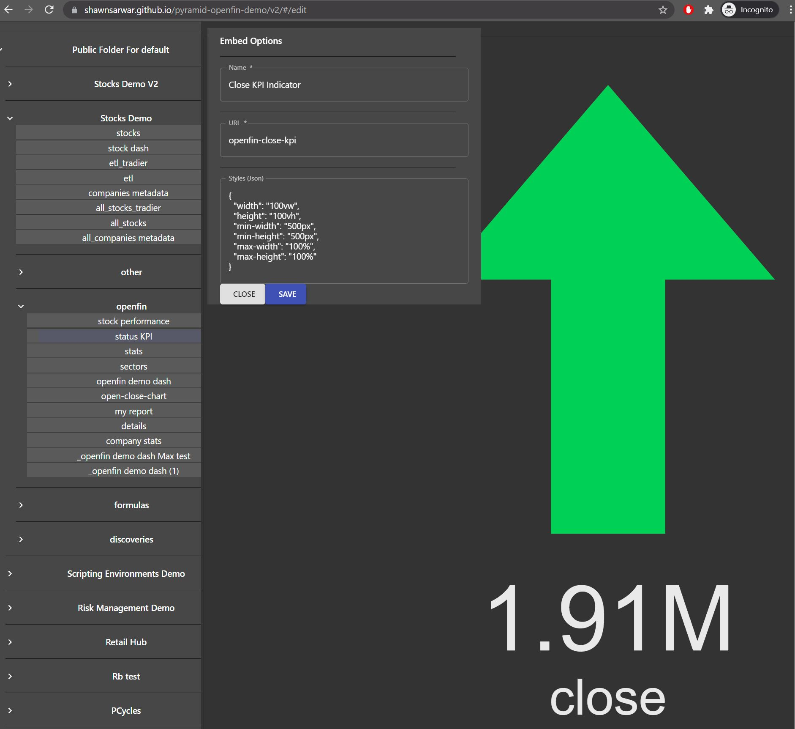
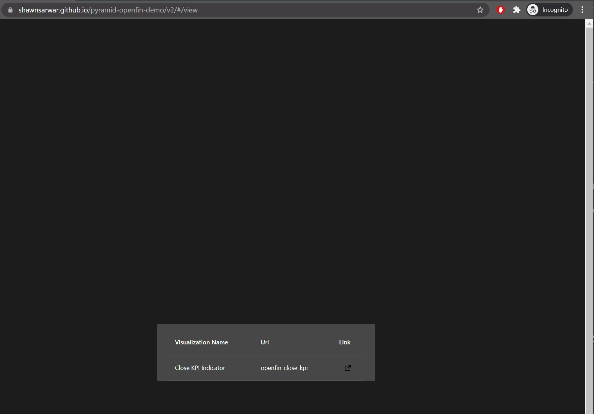
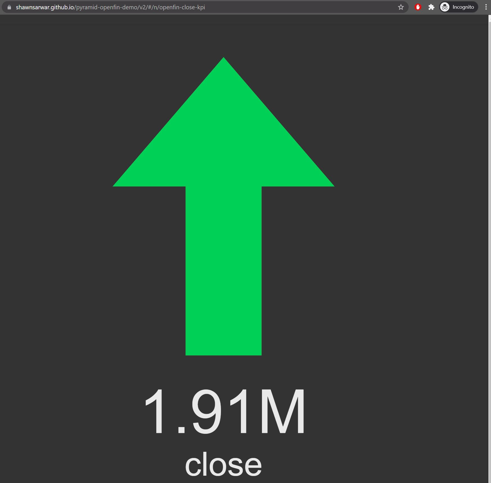
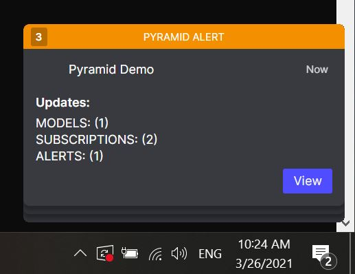
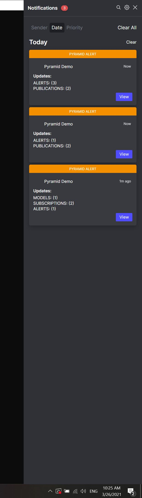

## Pyramid Embed Demo (OpenFin)

This repository acts as a both a hosted application for the demonstration of Pyramid Analytic's integration with OpenFin's Desktop, as well as a stand-alone embedding demo. This is a completely client side demo. Despite the artifacts being hosted, the only server components belong to the Pyramid instance that you point the application to. Your connection and authentication information and the content you build will reside in the IndexedDB of your browser (or OpenFin RVM) depending on your platform.

### Application Overview:

The application authenticates with a Pyramid instance where you have a valid user. 

You can then pick from content that is available for you users and create display profiles for the content, including CSS instructions for how the content will display when embedded.

Once a profile is saved for a piece of content, you can pick it from a list and view it.

When used within OpenFin, the application also will poll the Pyramid server for changes in your bulletin board and depending on what you've selected, optionally notify you via the OpenFin Notification Center.

### Browser Run (No Install)

To run the demo in place in a browser, just visit the following links:

 - [Settings / Authentication (Required First)](https://shawnsarwar.github.io/pyramid-openfin-demo/v2/#/settings)
 - [Browse and Edit Content](https://shawnsarwar.github.io/pyramid-openfin-demo/v2/#/edit)
 - [View Content](https://shawnsarwar.github.io/pyramid-openfin-demo/v2/#/view)
 - [View Your Saved Metadata](https://shawnsarwar.github.io/pyramid-openfin-demo/v2/#/metadata/all.json)
 
### OpenFin Run (Install Required)

To install OpenFin Desktop and run the demo there you'll need to do the following.

***IMPORTANT***: **this will change your OpenFin DOS setting and can break your previous OpenFin configuration should you have one.**

Prerequisites:
 - Windows
 - npm

Installation:
  - Clone this repository
  - enter `./local_install`
  - run: `npm i`
    - this installs OpenFin CLI
  - run: `npm run start:workspace`
    - when prompted answer "Yes" to the registry update.
    - this starts OpenFIN cli using our DOS profile.

OpenFin should start and present you with a Launcher. Start typing "PA" to be prompted with Pyramid content. See usage flow from the browser based section ^^

*To bring up the OF Launcher press "ctrl" and "space" at the same time.*

*Your notifications will appear as a pop-up.*

*And also in the OpenFin Notification Center in the Windows Toolbar.*

